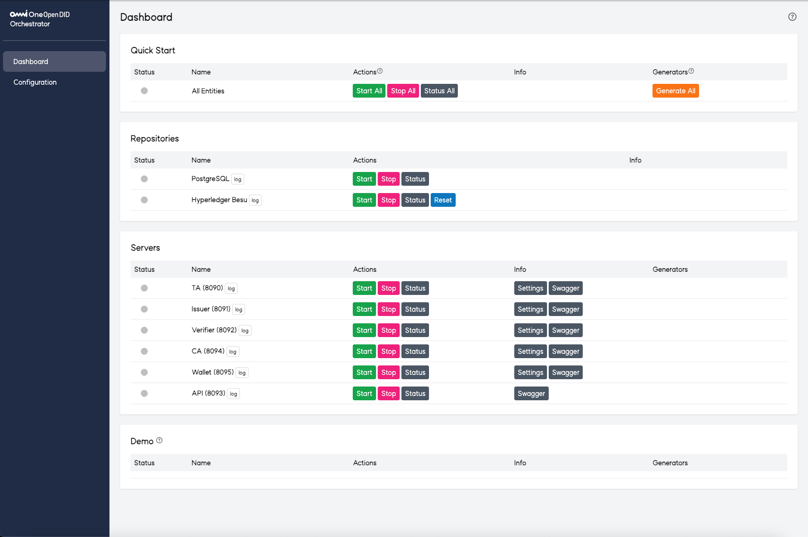

DID Orchestrator Server
==

DID Orchestrator 서버 Repository에 오신 것을 환영합니다. <br>
이 Repository는 DID Orchestrator 서버의 소스 코드, 문서, 관련 리소스를 포함하고 있습니다.

## DID Orchestrator 개요
DID Orchestrator는 OpenDID 시스템 내 다양한 서버 및 저장소 등의 상태를 모니터링하고 제어할 수 있는 통합 관리 도구입니다. 특히 쉬운 설치 및 구동을 촉진하여 사용자들이 손쉽게 OpenDID에 온보딩할 수 있도록 도와주는 역할을 합니다.



DID Orchestrator는 크게 아래와 같은 메뉴 및 기능으로 구성되어 있습니다.
- Dashboard : 서버 오케스트레이션 및 현황 모니터링 기능 제공 
  - Quick Start : 모든 엔티티들에 대한 빠른 실행/중단
  - Repositories : 블록체인 및 DB에 대한 실행/중단
  - Servers : 서버 엔티티들에 대한 실행/중단
  - Demo : 데모 서비스 대한 실행/중단
- Configuration : 자체 설정 정보 수정 기능 제공

## 폴더 구조
프로젝트 디렉터리 내 주요 폴더와 문서에 대한 개요:

```
did-orchestrator-server
├── CHANGELOG.md
├── CLA.md
├── CODE_OF_CONDUCT.md
├── CONTRIBUTING.md
├── LICENSE
├── MAINTAINERS.md
├── README.md
├── README_ko.md
├── RELEASE-PROCESS.md
├── SECURITY.md
├── dependencies-license.md
├── docs
│   ├── api
│   │   ├── Orchestrator_API.md
│   │   └── Orchestrator_API_ko.md
│   ├── installation
│   │   ├── OpenDID_orchestrator_InstallationAndOperation_Guide.md
│   │   └── OpenDID_orchestrator_InstallationAndOperation_Guide_ko.md
│   └── manual
│       ├── orchestrator_manual.md
│       └── orchestrator_manual_ko.md
└── source
    └── did-orchestrator-server
        ├── README.md
        ├── admin
        ├── build.gradle
        ├── configs
        ├── gradle
        ├── jars
        ├── logs
        ├── shells
        ├── src
        └── tool
```

<br/>

각 폴더와 파일에 대한 설명은 다음과 같습니다:

| 이름                             | 설명                                     |
| -------------------------------- | ---------------------------------------- |
| CHANGELOG.md                     | 프로젝트의 버전별 변경 사항              |
| CODE_OF_CONDUCT.md               | 기여자 행동 강령                         |
| CONTRIBUTING.md                  | 기여 지침과 절차                         |
| LICENSE                          | 라이선스                                 |
| dependencies-license.md          | 프로젝트 의존 라이브러리의 라이선스 정보 |
| MAINTAINERS.md                   | 프로젝트 유지 관리자 지침                |
| RELEASE-PROCESS.md               | 새 버전 릴리스 절차                      |
| SECURITY.md                      | 보안 정책 및 취약성 보고 방법            |
| docs                             | 문서화                                   |
| ┖ api                            | API 가이드 문서                          |
| ┖ installation                   | 설치 및 구동 가이드 문서                          |
| ┖ manual                         | 메뉴얼                          |
| source                           | 서버 소스 코드 프로젝트                  |
| ┖ did-orchestrator-server        | Orchestrator 서버 소스 코드 및 빌드 파일 |
| &nbsp;&nbsp;&nbsp;┖ gradle       | Gradle 빌드 설정 및 스크립트             |
| &nbsp;&nbsp;&nbsp;┖ libs         | 외부 라이브러리 및 종속성                |
| &nbsp;&nbsp;&nbsp;┖ src          | 주요 소스 코드 디렉터리                  |
| &nbsp;&nbsp;&nbsp;┖ admin        | Front-end 영역 디렉토리 |
| &nbsp;&nbsp;&nbsp;┖ shells       | Blockchain, RDBMS 등 기타 모듈 영역       |
| &nbsp;&nbsp;&nbsp;┖ build.gradle | Gradle 빌드 설정 파일                    |
| &nbsp;&nbsp;&nbsp;┖ README.md    | 소스 코드 개요 및 지침                   |

## 라이브러리

이 프로젝트에서 사용되는 라이브러리는 아래와 같이 구성됩니다:

- **백엔드 서드 파티 라이브러리**: 이 라이브러리들은 오픈 소스 종속성으로, [build.gradle](source/did-orchestrator-server/build.gradle) 파일을 통해 관리됩니다. 서드 파티 라이브러리와 해당 라이선스의 자세한 목록은 [dependencies-license.md](dependencies-license.md) 파일을 참고하십시오.
- **프론트엔드 서드 파티 라이브러리**: DID Orchestrator의 UI/UX를 제공하는 영역으로서, 자세한 사항은 source 영역 내 [README.md](source/did-orchestrator-server/README.md) 파일을 참고하십시오.
- **기타 라이브러리**: 블록체인, RDBMS 등과 같이 소스 영역에는 속하지 않는 모듈들로서, 보다 더 자세한 사항은 source 영역 내 [README.md](source/did-orchestrator-server/README.md) 파일을 참고하십시요.


## 설치 및 운영 가이드

Orchestrator 서버의 설치 및 구성에 대한 자세한 지침은 아래 가이드를 참조하십시오:
- [OpenDID Orchestrator 서버 설치 및 운영 가이드](docs/installation/OpenDID_orchestrator_InstallationAndOperation_Guide_ko.md)  

## API 참고 문서

- **Orchestrator API**: Orchestrator 서버의 API 엔드포인트 및 사용법에 대한 자세한 참고 자료입니다.
  - [Orchestrator API 참고 자료](docs/api/Orchestrator_API_ko.md)

## Change Log

Change Log에는 버전별 변경 사항과 업데이트가 자세히 기록되어 있습니다. 다음에서 확인할 수 있습니다:
- [Change Log](CHANGELOG.md)  

## OpenDID 시연 영상

OpenDID 시스템의 시연 영상을 보려면 [데모 Repository](https://github.com/OmniOneID/did-demo-server)를 방문하십시오. <br>

이 영상에서는 사용자 등록, VC 발급, VP 제출 프로세스 등 주요 기능을 시연합니다.

## 기여

기여 절차와 행동 강령에 대한 자세한 내용은 [CONTRIBUTING.md](CONTRIBUTING.md)와 [CODE_OF_CONDUCT.md](CODE_OF_CONDUCT.md)를 참조해 주십시오.

## 라이선스
[Apache 2.0](LICENSE)
