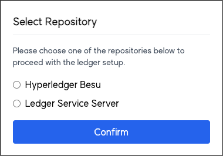

# Orchestrator User Manual

## 1. Overview
`Orchestrator` is a **unified server management console** that enables monitoring and controlling the status of various servers.  
This manual explains the core features, UI structure, usage guide, and important notes regarding Orchestrator.

## 2. Access
- **Access URL**: Open a web browser and go to `http://<server IP>:9001`.
- **Initial Screen**: Displays the status of all servers at a glance upon access.

## 3. Screen Structure
The Orchestrator interface consists of the following key sections:

### 3.1 Dashboard

#### 3.1.1 Quick Start
Provides batch control functions for all services and entities.

- **All Entities**
  - **Status Icons**
    -  Initial state before servers start
    -  All servers are running
    -  Some servers are running
    -  All servers are stopped
  - **Functions**
    - `Start All`: Starts all services and entities at once.
    - `Stop All`: Stops all services and entities at once.
    - `Status All`: Checks the status of all services and entities.
    - `Generate All`: Generates Wallets and DID Documents for all entities.

- **Wallet and DID Document Generation**:
  - If `easySettingModeEnabled` is `false`, a password input popup will appear. (Default is `true`)
  - After entering the password, a Wallet and DID Document will be generated for each entity using its name.

  

#### 3.1.2 Repositories
Allows individual management of key services such as Hyperledger Besu, Ledger Service Server, and PostgreSQL.

When first accessing Orchestrator, a popup appears to select a trust repository: Hyperledger Besu or Ledger Service Server.

- **Hyperledger Besu**
  - **Status Icons**
    -  Running
    -  Stopped
  - **Functions**
    - `Start`: Starts the service.
    - `Stop`: Stops the service.
    - `Status`: Checks the running status.
    - `Reset`: Resets the service and reselects the ledger.

- **Ledger Service Server**
  - **Status Icons**
    -  Running
    -  Stopped
  - **Functions**
    - `Start`: Starts the service.
    - `Stop`: Stops the service.
    - `Status`: Checks the running status.
    - `Reset`: Resets the service and reselects the ledger.

- **PostgreSQL**
  - **Status Icons**
    -  Running
    -  Stopped
  - **Functions**
    - `Start`: Starts the service.
    - `Stop`: Stops the service.
    - `Status`: Checks the running status.

#### 3.1.3 Servers
Provides management functions for individual servers.

- **Status Icons**
  -  Running
  -  Stopped

- **Display Info**: Server name and port number
- **Functions**
  - `Start`: Starts the server.
  - `Stop`: Stops the server.
  - `Status`: Checks the server status.
  - `Settings`: Opens the server's configuration page.
  - `Swagger`: Opens the Swagger API documentation page.
  - `Wallet`: Generates a Wallet for the server.
  - `DID Document`: Generates a DID Document for the server.

  #### * Wallet and DID Document buttons are hidden if `easySettingModeEnabled = true`.

- **Wallet Generation**:
  - Enter the entity name and password to generate a Wallet.

  

- **DID Document Generation**:
  - Enter the same name, DID, and password as the Wallet to generate a DID Document.

  

### 3.2 Configuration

#### 3.2.1 Blockchain
- For Hyperledger Besu: configure channel name, chaincode name, chain ID, and gas settings.
- For Ledger Service Server: configure port, path, and deployment filename.

#### 3.2.2 Database
- Configure database port and account credentials.

#### 3.2.3 Servers
- Configure each server’s name, port, and deployment file name.

#### 3.2.4 Service Paths
- Configure paths for various executables and configuration files.

#### 3.2.5 Generator
- Provides convenience options for generating Wallets and DID Documents.

- **easySettingModeEnabled**
  - `true`
    - Uses a fixed password to generate Wallets and DID Documents via `Generate All`.
    - Individual server generation is disabled.
  - `false`
    - Allows user-input passwords for both `Generate All` and individual generation.

## 4. Notes
- **Trust Repository Selection**: Upon first access, a blockchain or database can be selected as the trust repository.  
  Resetting will delete all registered data and allow selection of a new trust repository.
- **Startup/Shutdown Time**: `Start` and `Stop` operations may take time depending on the environment.
- **Individual Server Settings**: Use the `Settings` button to configure each server’s details.
- **Security**: Passwords used for Wallet and DID Document generation must be securely managed.

*Orchestrator is intended for the monitoring and control of individual entities. Detailed configuration must be performed via each entity's own settings page.
