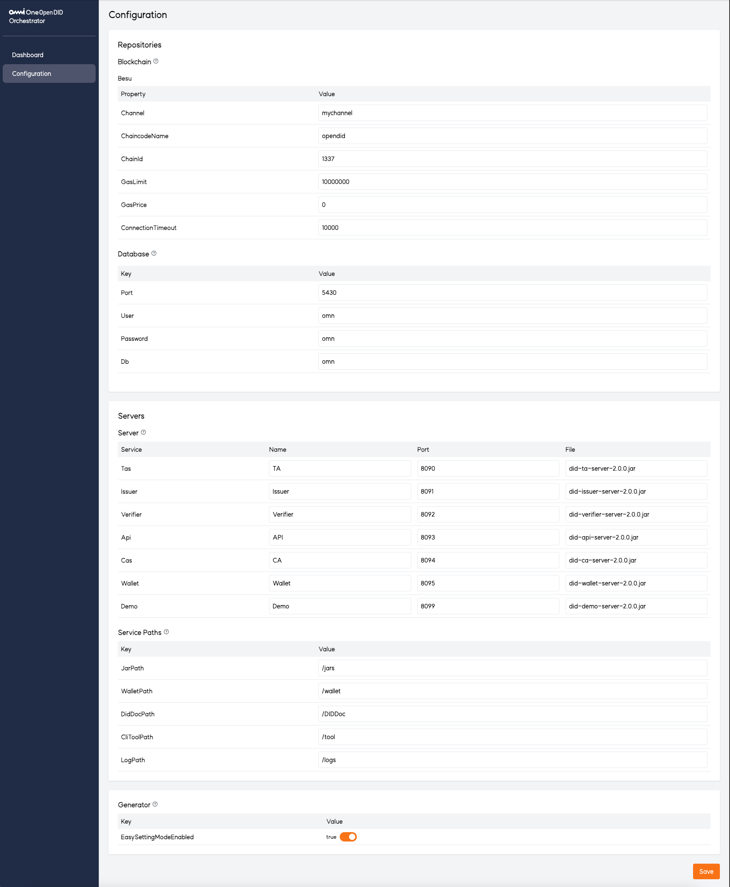

# Orchestrator 사용자 매뉴얼

## 1. 개요
`Orchestrator`는 **서버 통합 관리 콘솔**로, 다양한 서버의 상태를 모니터링하고 제어할 수 있는 통합 관리 도구입니다.  
본 매뉴얼은 Orchestrator의 주요 기능, 화면 구성, 사용 방법 및 주의사항을 설명합니다.

## 2. 접속 방법
- **접속 URL**: 웹 브라우저에서 `http://<서버 IP>:9001`로 접속합니다.
- **초기 화면**: 접속 후 전체 서버의 상태를 한눈에 확인할 수 있습니다.

## 3. 화면 구성
Orchestrator의 화면은 다음과 같은 주요 섹션으로 구성됩니다.

### 3.1 Dashboard

#### 3.1.1 Quick Start
전체 서비스 및 엔티티를 일괄적으로 관리할 수 있는 기능을 제공합니다.

- **All Entities**
  - **상태 아이콘**
    -  모든 서버가 구동 전 최초 상태
    -  모든 서버가 정상 실행 중
    -  일부 서버만 실행 중
    -  모든 서버가 중지됨
  - **기능**
    - `Start All`: 전체 서비스 및 엔티티를 일괄 실행합니다.
    - `Stop All`: 전체 서비스 및 엔티티를 일괄 종료합니다.
    - `Status All`: 전체 서비스 및 엔티티의 구동 상태를 확인합니다.
    - `Generate All`: 전체 엔티티의 Wallet 및 DID Document를 일괄 생성합니다.

- **Wallet 및 DID Document 생성**:
  - `easySettingModeEnabled`가 `false`인 경우 비밀번호 입력 팝업이 발생합니다. (기본값은 `true`)
  - 비밀번호 입력 시 각 엔티티의 이름으로 Wallet과 DID Document가 생성됩니다.

  

#### 3.1.2 Repositories
Hyperledger Besu, Ledger Service Server, PostgreSQL 등의 주요 서비스를 개별적으로 관리할 수 있습니다.

최초 접속 시 Hyperledger Besu 또는 Ledger Service Server를 선택하여 신뢰 저장소를 설정합니다.

- **Hyperledger Besu**
  - **상태 아이콘**
    -  실행 중
    -  중지됨
  - **기능**
    - `Start`: 서비스를 시작합니다.
    - `Stop`: 서비스를 종료합니다.
    - `Status`: 구동 상태를 확인합니다.
    - `Reset`: 초기화 후 ledger 재선택.

- **Ledger Service Server**
  - **상태 아이콘**
    -  실행 중
    -  중지됨
  - **기능**
    - `Start`: 서비스를 시작합니다.
    - `Stop`: 서비스를 종료합니다.
    - `Status`: 구동 상태를 확인합니다.
    - `Reset`: 초기화 후 ledger 재선택.

- **PostgreSQL**
  - **상태 아이콘**
    -  실행 중
    -  중지됨
  - **기능**
    - `Start`: 서비스를 시작합니다.
    - `Stop`: 서비스를 종료합니다.
    - `Status`: 구동 상태를 확인합니다.

#### 3.1.3 Servers
개별 서버에 대한 상세 관리 기능을 제공합니다.

- **상태 아이콘**
  -  실행 중
  -  중지됨

- **표시 정보**: 서버 이름, 포트 번호
- **기능**
  - `Start`: 개별 서버를 시작합니다.
  - `Stop`: 개별 서버를 종료합니다.
  - `Status`: 상태를 확인합니다.
  - `Settings`: 설정 페이지로 이동합니다.
  - `Swagger`: Swagger API 문서 페이지로 이동합니다.
  - `Wallet`: Wallet을 생성합니다.
  - `DID Document`: DID 문서를 생성합니다.

  #### * `easySettingModeEnabled = true`일 경우 Wallet 및 DID Document 생성 버튼은 비활성화됩니다.

- **Wallet 생성**:
  - 엔티티 이름과 비밀번호를 입력하여 Wallet을 생성합니다.

  

- **DID Document 생성**:
  - Wallet과 동일한 이름, DID, 비밀번호를 입력하여 DID Document를 생성합니다.

  

### 3.2 Configuration

#### 3.2.1 Blockchain
- Hyperledger Besu 사용 시 채널명, 체인코드명, 체인 ID, 가스 설정 등을 구성합니다.
- Ledger Service Server 사용 시 포트, 경로, 배포 파일명을 설정합니다.

#### 3.2.2 Database
- 데이터베이스의 포트 및 계정 정보를 설정합니다.

#### 3.2.3 Servers
- 개별 서버의 이름, 포트, 배포 파일명을 설정합니다.

#### 3.2.4 Service Paths
- 각종 실행 파일 및 설정 파일의 경로를 설정합니다.

#### 3.2.5 Generator
- Wallet 및 DID Document 생성 방식 설정을 제공합니다.

- **easySettingModeEnabled**
  - `true`
    - 고정된 패스워드로 `Generate All`을 통해 일괄 생성합니다.
    - 개별 서버 생성은 비활성화됩니다.
  - `false`
    - 사용자 입력 패스워드로 `Generate All` 및 개별 생성 모두 지원합니다.

## 4. 주의사항
- **신뢰 저장소 선택**: 최초 접속 시 블록체인 또는 DB를 기반으로 신뢰 저장소를 설정합니다.  
  리셋 시 기존 저장소의 모든 데이터는 삭제되며, 새로운 저장소를 선택할 수 있습니다.
- **서버 실행/종료 지연**: 실행 환경에 따라 `Start`, `Stop` 작업은 일정 시간이 소요될 수 있습니다.
- **개별 엔티티 설정**: `Settings` 버튼을 통해 각 서버의 상세 설정을 조정할 수 있습니다.
- **보안 주의**: Wallet 및 DID Document 생성 시 입력한 비밀번호는 안전하게 보관해야 합니다.

*Orchestrator는 개별 엔티티의 구동 및 모니터링을 목적으로 사용되며, 엔티티의 세부 설정은 각 서버의 설정 페이지에서 수행해야 합니다.