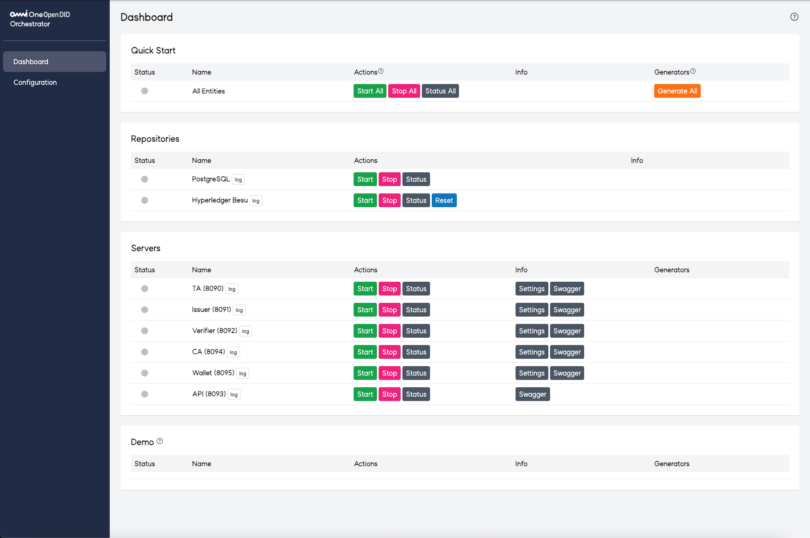
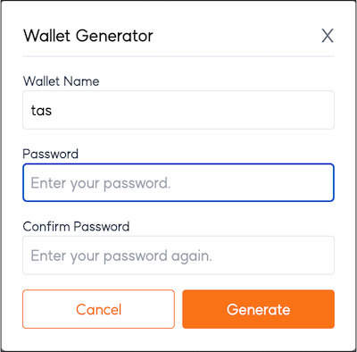
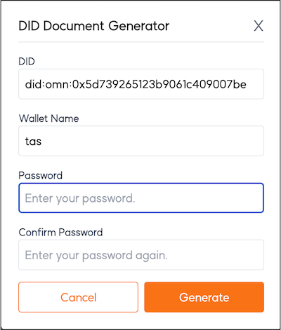

# Orchestrator 사용자 매뉴얼

## 1. 개요
`Orchestrator`는 **서버 통합 관리 콘솔**로, 다양한 서버의 상태를 모니터링하고 제어할 수 있는 통합 관리 도구입니다.  
본 매뉴얼은 Orchestrator의 주요 기능, 화면 구성, 사용 방법 및 주의사항을 설명합니다.

## 2. 접속 방법
- **접속 URL**: 웹 브라우저에서 `http://<서버 IP>:9001`로 접속합니다.
- **초기 화면**: 접속 후 전체 서버의 상태를 한눈에 확인할 수 있습니다.

## 3. 화면 구성
Orchestrator의 화면은 다음과 같은 주요 섹션으로 구성됩니다.

### 3.1 Dashboard

### 3.1.1 Quick Start
전체 서비스 및 엔티티를 일괄적으로 관리할 수 있는 기능을 제공합니다.

- **All Entities**
  - **상태 아이콘**
    -  모든 서버가 구동 전 최초 상태
    -  모든 서버가 정상 실행 중
    -  일부 서버만 실행 중
    -  모든 서버가 중지됨
  - **기능**
    - `Start All`: 전체 서비스 및 엔티티를 일괄 실행합니다.
    - `Stop All`: 전체 서비스 및 엔티티를 일괄 종료합니다.
    - `Status All`: 전체 서비스 및 엔티티의 구동 상태를 확인합니다.
    - `Generate All`: 전체 엔티티의 Wallet 및 DID Document를 일괄 생성합니다.

- **Wallet 및 DID Document 생성**:
  - easySettingModeEnabled가 false인 경우 비밀번호를 입력하는 팝업이 발생합니다.
    
    (default는 true로 설정되어 있습니다.)

  - 비밀번호를 입력하면 각 엔티티의 이름으로 Wallet과 DID Document가 생성됩니다.

  

### 3.1.2 Repositories
주요 서비스(예: Hyperledger Fabric, PostgreSQL)를 개별적으로 관리할 수 있는 기능을 제공합니다.

- **Hyperledger Fabric**
  - **상태 아이콘**
    -  실행 중
    -  중지됨
  - **기능**
    - `Start`: Hyperledger Fabric 서비스를 시작합니다.
    - `Stop`: Hyperledger Fabric 서비스를 종료합니다.
    - `Status`: Hyperledger Fabric의 구동 상태를 확인합니다.
    - `Reset`: Hyperledger Fabric을 초기화합니다.

- **PostgreSQL**
  - **상태 아이콘**
    -  실행 중
    -  중지됨
  - **기능**
    - `Start`: PostgreSQL 서비스를 시작합니다.
    - `Stop`: PostgreSQL 서비스를 종료합니다.
    - `Status`: PostgreSQL의 구동 상태를 확인합니다.

### 3.1.3 Servers
개별 서버를 관리할 수 있는 기능을 제공합니다.

- **개별 서버 관리**
  - **상태 아이콘**
    -  실행 중
    -  중지됨
  - **표시 정보**: 서버 이름 및 포트 번호
  - **기능**
    - `Start`: 개별 서버를 시작합니다.
    - `Stop`: 개별 서버를 종료합니다.
    - `Status`: 개별 서버의 구동 상태를 확인합니다.
    - `Settings`: 개별 서버의 설정 페이지로 이동합니다.
    - `Swagger`: 개별 서버의 Swagger API 문서 페이지로 이동합니다.
    - `Wallet`: 개별 서버의 Wallet을 생성합니다.
    - `DID Document`: 개별 서버의 DID Document를 생성합니다.

    #### * 개별서버의 Wallet과 DID Document생성은 easySettingModeEnabled가 true의 경우에는 보이지 않습니다.

- **Wallet 생성**:
  - Wallet의 이름과 비밀번호를 입력하여 해당 엔티티의 Wallet을 생성합니다.

- **DID Document 생성**:
  - 생성한 Wallet과 동일한 이름, DID, 비밀번호를 입력하여 해당 엔티티의 DID Document를 생성합니다.

### 3.2 Configuration

### 3.2.1 Blockchain
블록체인의 채널명, 체인코드명을 설정합니다.

### 3.2.2 Database
데이터베이스의 포트, 계정정보를 설정합니다.

### 3.2.3 Servers
개별서버의 이름, 포트정보, 배포파일명을 설정합니다.

### 3.2.4 Service Paths
각 파일의 경로를 설정합니다.

### 3.2.5 Generator
월렛 및 DID Document의 생성 시 편의성을 제공합니다.

- **easySettingModeEnabled**
    - true
      - 고정패스워드 기반으로 Generate All을 통하여 월렛과 DID Document를 일괄 생성합니다.
      - 개별 서버의 월렛 및 DID Document 생성은 지원하지 않습니다.
    - false
      - 사용자 입력 패스워드 기반으로 Generate All을 통하여 월렛과 DID Document를 일괄 생성합니다.
      - 사용자 입력 패스워드 기반으로 개별 서버의 월렛 및 DID Document 생성합니다.

## 4. 주의사항
- **서버 실행/종료 시간**: `Start` 또는 `Stop` 버튼을 사용할 경우, 서버 실행 환경에 따라 일정 시간이 소요될 수 있습니다.
- **개별 엔티티 설정**: `Settings` 버튼을 통해 개별 서버의 상세 설정을 조정할 수 있습니다.
- **보안**: Wallet 및 DID Document 생성 시 비밀번호를 안전하게 관리해야 합니다.

*Orchestrator는 개별 엔티티의 구동 및 모니터링을 목적으로 사용되며, 각 개별 엔티티의 설정은 개별 엔티티의 설정 페이지를 통해 수행해야 합니다.
